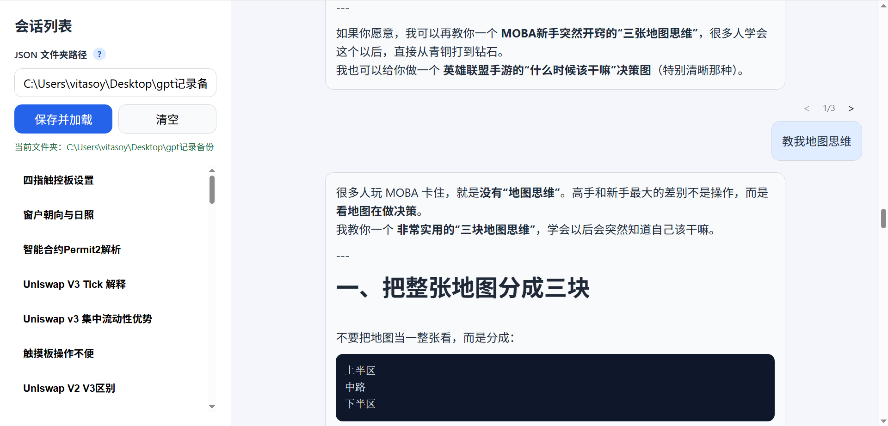

# ChatGPT Export Reader

一个用于本地阅读 ChatGPT 导出 JSON 聊天记录的轻量工具，支持会话列表浏览、Markdown 渲染，以及对话分支切换。

## 背景说明

这个项目用于阅读 Chrome 插件 [ChatGPT Degrade Checker - 降级检测器](https://chromewebstore.google.com/detail/chatgpt-degrade-checker-%E9%99%8D/inidgeckbobnafenlmlgfbeoijiamepm) 导出的 JSON 聊天记录。

导出的聊天记录包含树状分支结构，普通 JSON 查看方式不方便阅读，也不方便切换不同分支。本项目的目标是把这些 JSON 记录整理成更接近日常聊天界面的阅读体验，并支持在分支节点之间切换查看。

## 效果预览



## 功能特性

- 读取指定文件夹中的 JSON 聊天记录
- 左侧展示会话列表，右侧展示会话详情
- 支持 Markdown 基础渲染
- 支持树状对话分支切换
- 支持记住上次使用的 JSON 文件夹路径
- 左右区域独立滚动，互不影响

## 运行要求

- Node.js 18+，推荐 20+
- npm 9+

## 安装

```bash
npm install
```

## 启动

```bash
npm start
```

默认访问地址：

- `http://localhost:3000`

## 使用方式

1. 启动服务后打开 `http://localhost:3000`
2. 在左侧输入 JSON 文件夹路径
3. 点击“保存并加载”
4. 选择左侧会话查看详情
5. 如果某个节点存在多个后续分支，可在对应用户卡片上方切换不同分支

## 数据目录说明

由于普通浏览器页面不能稳定获取并持久化系统文件夹绝对路径，当前实现采用“后端保存文件夹路径”的方式。

应用会把当前选择的目录保存到项目根目录下的 `data-directory.json` 中。服务重启后会优先恢复这个路径。

## 环境变量

- `PORT`：服务端口，默认 `3000`
- `DATA_DIR`：初始 JSON 数据目录。仅在尚未生成 `data-directory.json` 时作为启动默认值

示例：

```bash
PORT=4000 DATA_DIR=./data npm start
```

Windows PowerShell 示例：

```powershell
$env:PORT=4000
$env:DATA_DIR=".\\data"
npm start
```

## 支持的数据

当前实现面向包含 `mapping` 字段的 ChatGPT 对话导出 JSON。

程序会过滤：

- `system` 节点
- 被标记为隐藏的节点
- 空文本节点

## 常见问题

### 打开页面没有会话

确认已经保存了正确的 JSON 文件夹路径，并且该目录中存在合法的 `.json` 文件。

### 某些消息没有显示

当前版本只展示可阅读的文本内容，不展示被过滤掉的隐藏节点或空节点。

### 为什么不是直接在浏览器里选择任意文件夹并永久记住

这是浏览器安全模型限制导致的。当前项目使用后端配置文件保存目录路径，稳定且简单。

## 开源协议

本项目采用 [MIT License](LICENSE) 开源，你可以自由使用、修改、分发，但需要保留原始版权与许可说明。
